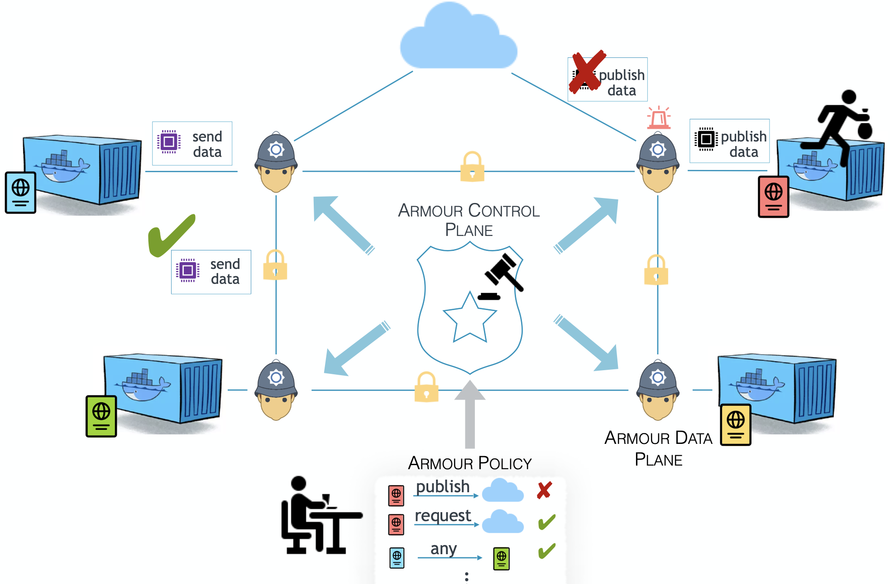

# Armour

The goal of Armour is to secure applications developped using micro-services. A feature of micro-services is that they can be developed by loosely connected teams (using different programming languages) and deployed independently. This approach hampers security and safety analysis, and it makes end-to-end security arguments hard to establish.

Armour provides a custom programming policy language to describe security policies at
  the API level of micro-services and a distributed enforcement infrastructure, composed of a data plane, containing a proxy that enforces an Armour policy for each micro-service, and a control plane, that manages multiple data-planes, to secure applications developed using micro-services.

## Getting started
- [Build Armour Locally](src/README.md)
- [Getting Started Guides](examples/)
- [Architecture and Component](docs/README.md)
- [Performance Evaluation](benchmark/README.md)
- [Future Work](docs/future_work.md)

## License

Armour is provided under an MIT license. Contributions to this project are accepted under the same license.

## Getting involved

If you'd like to contribute or have questions, please reach out to one of [the authors](AUTHORS.md).

