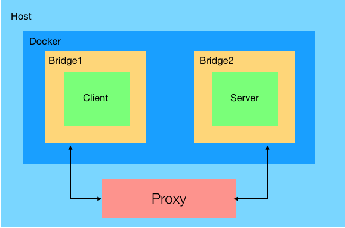
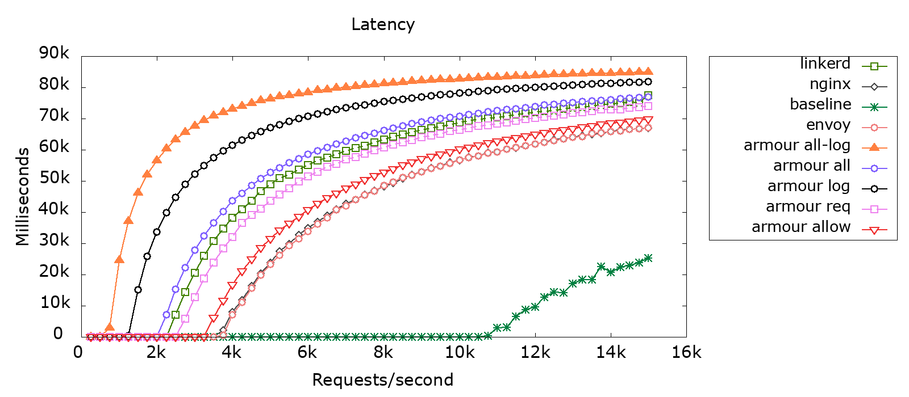
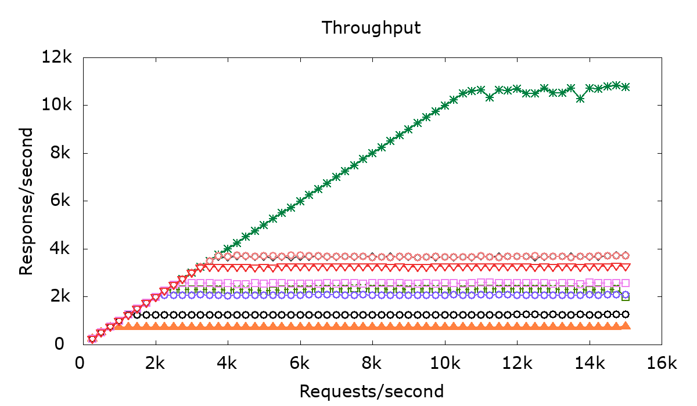
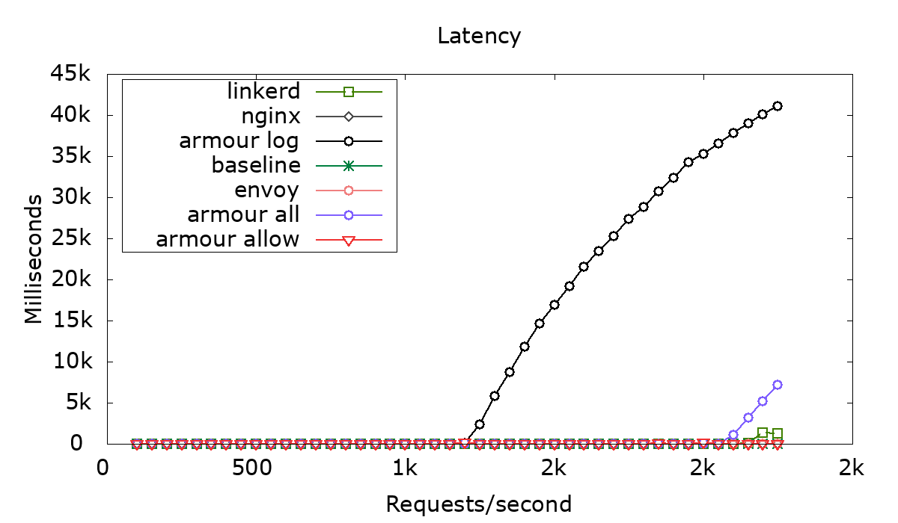
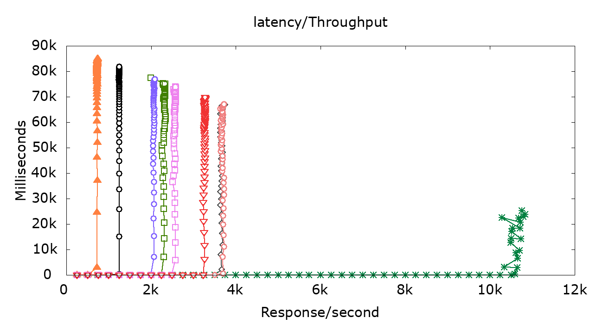

# Armour data-plane performance analysis

### Directory Contents

- `containers/`: configuration files of the containers: clients running `wrk2` tool, `hyper` server and configuration files for the proxies used `armour`, `envoy`, `nginx`, `linkerd` and `sozu`.
- `scripts/`: scripts to run the performance analysis.
- `results/`: plots for the latest performance evaluation and a benchmark of several web servers (`hyper`, `actix-web`, `apache`, `nginx web server`, `cherokee`, `lighttpd`).

### Overview
- [`NGINX proxy`](https://docs.nginx.com/nginx/admin-guide/web-server/reverse-proxy/)
- [`Envoy`](https://www.envoyproxy.io/docs/envoy/latest/intro/what_is_envoy)
- [`Sozu`](https://www.sozu.io)
- [`Linkerd`](https://linkerd.io/2.10/overview/)
- [`Armour`](../docs/README.md)
 
### Environment

The tests were done on AWS t2.large EC2 instances running Amazon Linux 2 AMI (Linux kernel 4.14), 8GiB memory, 2 vCPU, 50GB storage.

The client and the server are containerised, each in a separate container in a different docker bridge network, however, the proxies are running on the VMs host. The client, server and the proxy are running on the same VM 

 

The Proxies and server tested versions: 

> It is important to keep in mind, that while running each test, `armour` and the `logger` keep changing, before talking about the results, the version (git commit hash) used in each test will be mentioned along with the versions of the libraries used in both of them.

- `nginx proxy 1.16.1`
- `envoy 1.12.1`
- `sozu 0.11.0`
- `linkerd 1.7.0`
- `armour 17 Jan` commit hash: (fill)
- `logger oracle 17 Jan` commit hash: (fill)
- `hyper web server 0.12.35`

### Tools used
The client is running [wrk2](https://github.com/giltene/wrk2), a modern HTTP benchmarking tool capable of generating significant load, up to 40k requests per second, when run on a single multi-core CPU.
An optional LuaJIT script can perform HTTP request generation, response processing, and custom reporting. one thing to note about the latency results produced by `wrk2` is that it measures the total time from issuing the request till receiving a response.

The server used in this benchmark is `hyper`, the choice of the server was made after running a benchmark on multiple web server. [web servers benchmark](results/server/README.md)

To measure CPU usage and memory, [psrecord](https://github.com/astrofrog/psrecord) was used, it's a small utility that uses the [psutil](https://github.com/giampaolo/psutil/) library to record the CPU and memory activity of a process.

### Armour policies 
There were 12 different policy setups test during this benchmark, they can be split into 2 parts, policies using different methods but without using any oracle and policies that use oracles.

For the first set of policies:

 `allow`: run the proxy with an allow all. 

 

	allow all

 `all`: uses all 4 entry points in the policy, `allow_rest_request`, `allow_rest_response`, `allow_client_payload` and `allow_server_payload`

 

		fn allow_rest_request(req: HttpRequest) -> bool {
    		let c = req.connection();
    		let (from, to) = c.from_to(); 
    		if "srv-hyper" in to.hosts() {
        		"client-1" in from.hosts() || to.port() == Some(80)
     		} else {false}
		}
		
		fn allow_client_payload(payload: Payload) -> bool {
    		payload.data().len() < 3000
		}

		fn allow_server_payload(payload: Payload) -> bool {
    		payload.data().len() < 3000
		}

		fn allow_rest_response(res: HttpResponse) -> bool {
    		res.status() == 200
		}
		

 `req-res`: uses `allow_rest_request` and `allow_rest_response` 

 

		fn allow_rest_request(req: HttpRequest) -> bool {
    		let c = req.connection();
    		let (from, to) = c.from_to(); 
   			if "srv-hyper" in to.hosts() {
       		"client-1" in from.hosts() || to.port() == Some(80)
     		} else {false}
		}

		fn allow_rest_response(res: HttpResponse) -> bool {
    		res.status() == 200
		}

 `req`: uses `allow_rest_request`, a policy that talks about IDs (hosts names and ports) 

 
		
		fn allow_rest_request(req: HttpRequest) -> bool {
    		let c = req.connection();
    		let (from, to) = c.from_to(); 
    		if "srv-hyper" in to.hosts() {
        		"client-1" in from.hosts() || to.port() == Some(80)
     		} else {false}
		}

 `req-method`: uses `allow_rest_request`, a policy that talks about the request's method 

 

		fn allow_rest_request(req: HttpRequest) -> bool {
  			return req.method() == "GET"
		}

 `res`: uses `allow_rest_response` 

 

		fn allow_rest_response(res: HttpResponse) -> bool {
    		res.status() == 200
		}

 `srv-payload`: uses `allow_server_payload` 

 

	fn allow_server_payload(payload: Payload) -> bool {
    	payload.data().len() < 3000
	}

For the second set of policies that use oracles:

 `log`: uses the log function in the logger with an allow all policy 

 

	external logger @ "log_sock" {
  		fn log(_) -> ()
	}
	fn allow_rest_request(req: HttpRequest) -> bool {
  		logger::log(req);
  		true
	}

 `all-log`: uses the logger in all 4 policy functions, all calls to various functions in the logger are sync 

 

	external logger @ "log_sock" {
   		fn log(_) -> ()
    	fn rest(i64, str, str, str, ID, ID) -> ()
    	fn client_payload(i64, i64) -> ()
    	fn server_payload(i64, i64) -> ()
	}
    
	fn allow_rest_request(req: HttpRequest) -> bool {
   		let c = req.connection();
   		let (from, to) = c.from_to();
   		let date = if let Some(date) = req.unique_header("date") {
        		str::from_utf8(date)
     		} else {"-"};
    		logger::rest(c.number(), date, req.method(), req.path(), from, to);
    		if "srv-hyper" in to.hosts() {
        		"client-1" in from.hosts() || to.port() == Some(80)
     		} else {false}
		}

		fn allow_client_payload(payload: Payload) -> bool {
    		logger::client_payload(payload.connection().number(), payload.data().len());
    		payload.data().len() < 3000
		}

		fn allow_server_payload(payload: Payload) -> bool {
    		logger::server_payload(payload.connection().number(), payload.data().len());
    		payload.data().len() < 3000
		}

		fn allow_rest_response(res: HttpResponse) -> bool {
    		logger::log(res.header("date"));
    		res.status() == 200
		}

 `all-async-log`: the same policy as before but all calls to functions in the logger are async, for example: 

 

		async logger::log(res.header("date"));

 `async log`: uses the log function with an allow all, the call to log is async 

 

		external logger @ "log_sock" {
  			fn log(_) -> ()
		}
		fn allow_rest_request(req: HttpRequest) -> bool {
  			async logger::log(req);
  			true
		}

 `req-log`: uses `allow_rest_request` with the logger 

 

		external logger @ "log_sock" {
    		fn rest(i64, str, str, str, ID, ID) -> ()
		}
    
		fn allow_rest_request(req: HttpRequest) -> bool {
    		let c = req.connection();
    		let (from, to) = c.from_to();
    		let date = if let Some(date) = req.unique_header("date") {
       		str::from_utf8(date)
     		} else {"-"};
    		logger::rest(c.number(), date, req.method(), req.path(), from, to);
    		if "srv-hyper" in to.hosts() {
        		"client-1" in from.hosts() || to.port() == Some(80)
     		} else {false}
		}

### NGINX policies

	worker_processes 1;
	events { worker_connections 1024; }
	http {

	    log_format compression '$remote_addr - $remote_user [$time_local] '
	        '"$request" $status $upstream_addr '
	        '"$http_referer" "$http_user_agent" "$gzip_ratio"';
	
	    upstream app1 {
	        server srv-hyper:80;
	    }
	    server {
	        listen 80;
	        access_log /var/log/nginx/access.log compression;
	
	        location /hyper {
	            proxy_pass         http://app1/;
	            proxy_redirect     off;
	            proxy_set_header   Host $host;
	            proxy_set_header   X-Real-IP $remote_addr;
	            proxy_set_header   X-Forwarded-For $proxy_add_x_forwarded_for;
	            proxy_set_header   X-Forwarded-Host $server_name;
	        }
	    }
	}

### Envoy policies

	admin:
  	access_log_path: /tmp/admin_access.log
  	address:
    	socket_address: { address: 0.0.0.0, port_value: 9901 }

	static_resources:
  		listeners:
  		- name: listener_http1
    		address:
      			socket_address: { address: 0.0.0.0, port_value: 8080 }
    		filter_chains:
    		- filters:
      			- name: envoy.http_connection_manager
       		 config:
          		stat_prefix: ingress_http
          		route_config:
            			name: local_route
            			virtual_hosts:
            			- name: local_service
              			domains: ["*"]
              			routes:
              - match: { prefix: "/" }
                route: { cluster: backend-hyper }
          http_filters:
          - name: envoy.router

        - name: listener_tcp1
            address:
                socket_address: { address: 0.0.0.0 , port_value: 1998 }
            filter_chains:
            - filters:
                - name: envoy.tcp_proxy
                    config:
                        stat_prefix: ingress_tcp
                        cluster: backend-hyper

        clusters:
        - name: backend-hyper
            connect_timeout: 0.40s
            type: LOGICAL_DNS
            dns_lookup_family: V4_ONLY
            lb_policy: ROUND_ROBIN
            hosts: [{ socket_address: { address: srv-hyper , port_value: 80 }}]
            
### Linkerd policies

Linkerd setup is a bit different from the previous tools, there is no need for a configuration file.

## Results

#### Latency & Throughput

##### Latency

This is to measure how long it takes for the web server to receive and serve different amounts of requests per second in a 90 seconds while going through different proxies each time. For this test, the command used follows the format:

	./wrk -c1 -t1 -R$j -d90s --latency  http://server
where the number of concurrent connections is always 1 and we vary the requests per second from 1000 to 25000, from one test to the other we increase the number of requests per second by 1000, each test is run for 90s.

For the results, the lower the curve is the faster the proxy in question processes the requests and responds to them.

##### Throughput

This is to measure how many Responses per second the client receives from the server while going through a proxy for a specific number of Requests per second, for example: the client sends 5K/s but the servers responds to only 3k/s. For this test, the commands used follow the format:

	./wrk -c1 -t1 -R$j -d90s --latency  http://server
where the number of concurrent connections is always 1 and we vary the requests per second from 1000 to 25000, from one test to the other we increase the number of requests per second by 1000, each test is run for 90s.

For the results, the higher the curve is more responses the client gets from the server.

The first graph represents the latency for all of the different (12) armour setups, Linkerd, envoy, nginx and the baseline.

The graph above has a lot of info, to split it a bit, the following graph shows the latency of basic setups for `nginx`, `linkerd`, `envoy`, `armour` with an allow all policy, `armour` with an all policy and the baseline.

#### Memory usage
The memory usage was measured while running the throughput and latency test, the number or requests per second decreases with time, from 25k request per second to 1k request per second while the number of connection is always 1.

