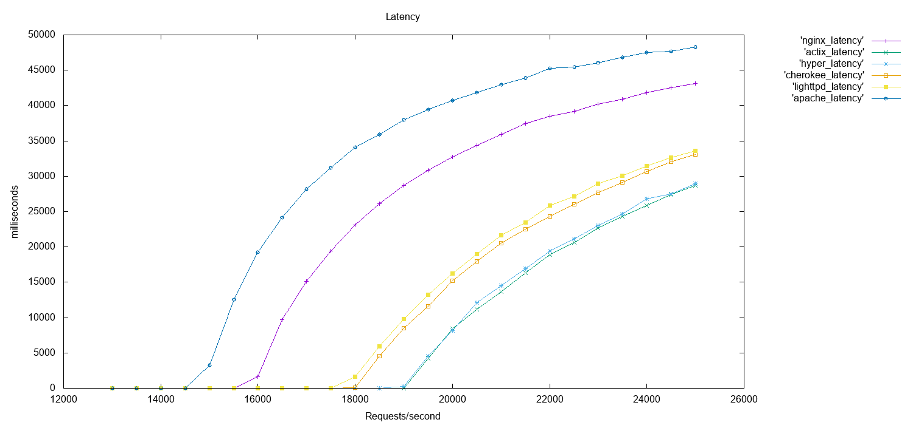

#Web servers benchmark

###Overview
- `Apache`: HTTPd, open-source cross-platform web server software, written in C, C++ [link](https://httpd.apache.org)
- `Actix web`: Rust server [repo](https://github.com/actix/actix-web)
- `Hyper`: Rust server [link](https://hyper.rs) [repo](https://github.com/hyperium/hyper) 
- `Nginx web server`: Can also be used as a reverse proxy, load balancer, mail proxy and HTTP cache, written in C [link](https://www.nginx.com/resources/wiki/)
- `Lighttpd`: open-source web server optimised for speed-critical environments while remaining standards-compliant, secure and flexible, written in C. [link](https://www.lighttpd.net)
- `Cherokee`: open-source cross-platform web server/reverse proxy, written in C, Python, JS [link](https://cherokee-project.com)

###Tools used
The client is running [wrk2](https://github.com/giltene/wrk2), a modern HTTP benchmarking tool capable of generating significant load, up to 40k requests per second, when run on a single multi-core CPU.
An optional LuaJIT script can perform HTTP request generation, response processing, and custom reporting.

To measure CPU usage and memory, [psrecord](https://github.com/astrofrog/psrecord) was used, it's a small utility that uses the [psutil](https://github.com/giampaolo/psutil/) library to record the CPU and memory activity of a process. 

###Test environment
All tests were done in a AWS EC2 t2.large instance with 2 vCPUs and 8 GiB of memory, running Amazon Linux 2 AMI - Linux kernel 4.14. The client and the servers were all containerised, each in a separate container. This is a comparison for only static content, where after each requests all servers output the same static content.

The web servers tested versions:

* `Apache 2.4.41`
* `Actix web 0.1.0`
* `Hyper 0.12.35`
* `NGINX 1.17.5`
* `Cherokee 1.2.104`
* `Lighttpd 1.4.54`

###Results
####Latency

This is to measure how long it takes for the web server to receive and serve different amounts of requests per second in a certain period of time. For this test, the commands used follow the format:

	./wrk -c1 -t1 -R$j -d60s --latency  http://server
where the number of concurrent connections is always 1 and we vary the requests per second from 500 to 25000, from one test to the other we increase the number of requests per second by 500, each test is run for 60s.

For the results, the lower the curve is the faster the server in question processes the requests and responds to them,

####Throughput

This is to measure how many Responses per second the client receives from the server for a specific number of Requests per second, for example: the client sends 5K/s but the servers responds to only 3k/s. For this test, the commands used follow the format:

	./wrk -c1 -t1 -R$j -d60s --latency  http://server
where the number of concurrent connections is always 1 and we vary the requests per second from 500 to 25000, from one test to the other we increase the number of requests per second by 500, each test is run for 60s.

For the results, the higher the curve is more responses the client gets from the server.

####Scalability

This is to measure the number of responses per second the server serves while we increase the number of concurrent connections by 100 from 1 client to 2500 clients with a fixed number of requests per second of 25k/s. For this test, the commands used follow the format:

	./wrk2/wrk -c$i -t1 -R25000 -d60s --latency  http://server
PS: the number of Requests per second each client sends is 25k / number of clients.

For the results, the higher the curve is more requests made by more clients can be served by the server.
	

####Memory usage
This is to measure the memory usage while running the scalability test, increasing the number of clients from a single client to 2500 clients with a fixed number of requests per second of 25k/s.

The memory usage of different web servers is fairly low and they all behave the same way except for Actix web that consumes 4x more memory than the rest.

We measured the memory usage while running the throughput test, increasing the number of requests per second for a single client.

The memory usage doesn't seem to be effected by the amount of Requests being sent by the client, but more effected with how many clients are making the requests.

####CPU usage
This is to measure CPU usage while running the scalability test, increasing the number of clients from a single client to 2500 clients with a fixed number of requests per second of 25k/s.

This is to measure CPU usage while running the throughput test, increasing the number of requests per second for a single client.

###Conclusion
After Running this micro-benchmark on different web servers, we aimed to start using Hyper as a web server in the rest of the data plane benchmark.

####Other web servers performance comparison
[Benchmark of 27 servers](http://gwan.com/benchmark)

[Web server performance comparison](https://help.dreamhost.com/hc/en-us/articles/215945987-Web-server-performance-comparison)