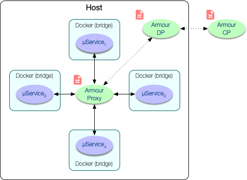
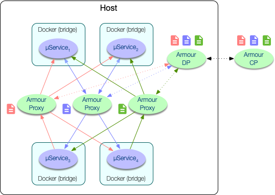
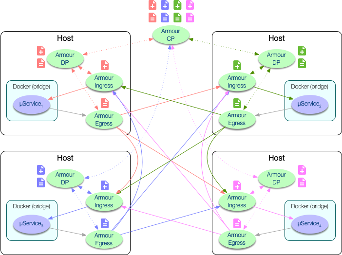

Armour Documentation
====================


See the [language](language.md) documentation for a description of the Armour policy language.

Armour Architecture
-------------------

### Single host, single proxy

<center>

</center>

### Single host, multiple proxies

<center>

</center>

### Sidecar proxies

<center>

</center>

Armour Control
--------------

**`armour-control`** manages a [mongoDB](https://www.mongodb.com) database of policies, hosts and services. Policies are forwarded to **`armour-host`** instances when services are started and when policies are updated.

### Options

**`armour-control`** provides two command line options:

```
OPTIONS:
    -m, --mongo <URL>    MongoDB URL
    -p, --port <PORT>    Control plane port
```

The `-p` flag determines the local host TCP port used by **`armour-control`**, which is used to receive commands from the command line program **`armour-ctl`**. By default, **`armour-control`** uses port `8088`.

The `-m` flag specifies the URL of the mongoDB database service (see below).

### mongoDB setup

The `mongodb` service can be started with:

```
% brew services start mongodb-community
```

on `macOS` and

```
% sudo systemctl start mongod
```

on Linux.

A TCP socket is used to communicate with mongoDB. The default URL is `mongodb://localhost:27017`, however, this can be changed using the file `/etc/mongod.conf` (Linux) or `/usr/local/etc/mongod.conf` (macOS), prior to starting the service. For example:

```
...
net:
  bindIp: 127.0.0.1
  port: 27018
```

will set the port to be `27018`. Armour control should then be started with

```
% armour-control -m mongodb://localhost:27018
```

Armour Ctl
----------

```
OPTIONS:
    -c, --control <URL>    control plane URL

SUBCOMMANDS:
    drop        Remove a policy
    drop-all    Remove all policies
    help        Prints this message or the help of the given subcommand(s)
    list        List hosts, services or policies
    query       Query a policy
    update      Update a policy
```