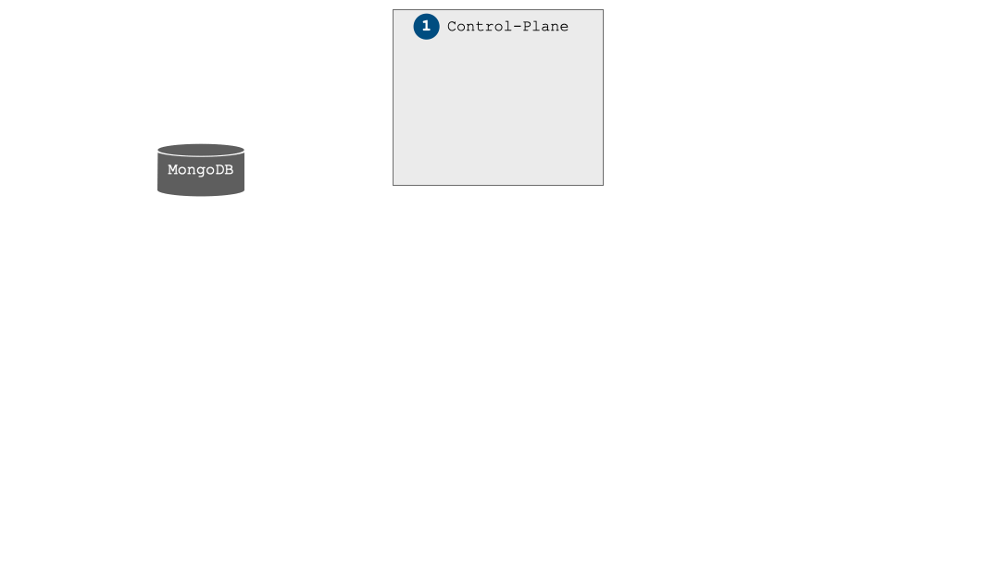

# Armour Architecture and Components


## Armour Architecture


## Armour Components

- **Control Plane** responsable for onboarding new micro-services and Armour data-planes depending on the evaluated onboarding policy, also specializes the global policy for each armour-proxy. Policies are forwarded to **`armour-host`** instances when services are started and when policies are updated. And manages a [mongoDB](https://www.mongodb.com) database of policies, hosts and services. 

    - **Control Plane Language** See the [language](CP-language.md) documentation for a description of the Armour Control-Plane policy language (the onboarding and global policy).
- **Data Plane** has 2 components Armour host and one or many Armour proxies.
    - **Armour Host** manages Armour proxies and fowards policies to them.
    - **Armour Proxy** a micro-service traffic goes through the proxy and gets evaluated according to a local Armour policy, depending on that evaluation, traffic is allowed or denied or modified (appends Armour specific labels).
    - **Data Plane Language** See the [language](DP-language.md) documentation for a description of the Armour Data-Plane policy language.
- **Armour-ctl** Armour control command line tool allows to update, query and remove all types of armour policies, global policy, on-boarding policy and local policies.
```
USAGE:
    armour-ctl [OPTIONS] [SUBCOMMAND]

FLAGS:
    -h, --help       Prints help information
    -V, --version    Prints version information

OPTIONS:
        --ca <PEM file>                  Certificate Authority certificate for HTTPS
        --cert <pkcs12 file>             Certificate for HTTPS
        --pass <CERTIFICATE_PASSWORD>    Password for certificate
    -c, --control <URL>                  control plane URL

SUBCOMMANDS:
    drop                 Remove a policy
    drop-all             Remove all policies
    drop-global          Remove the global policy
    drop-onboarding      Remove the onboarding policy
    help                 Prints this message or the help of the given subcommand(s)
    list                 List hosts, services or policies
    query                Query a policy
    query-global         Query the global policy
    query-onboarding     Query the onboarding policy
    specialize           Specialize a global policy using the provided information
    update               Update a policy
    update-global        Update the global policy
    update-onboarding    Update the onboarding policy
```
- **Armour-launch** a command line tool that takes an `armour-compose.yml` file as input describing for each micro-service its side-car configuration, invokes `Armour-compose` and generates `iptables` rules that are responsable for redirecting traffic from a micro-service to a specific `Armour-proxy`
```
USAGE:
    armour-launch [OPTIONS] <input file> <SUBCOMMAND>

FLAGS:
    -h, --help       Prints help information
    -V, --version    Prints version information

OPTIONS:
        --ca <PEM file>                  Certificate Authority for HTTPS
        --cert <pkcs12 file>             Certificate for mTLS
        --pass <certificate password>    Password for certificate
    -f <file>                            alternate compose file
    -m, --host <URL>                     data plane host URL

ARGS:
    <input file>    

SUBCOMMANDS:
    down     Stop Armour compose
    help     Prints this message or the help of the given subcommand(s)
    rules    Generate iptables rules
    up       Start Armour compose
```
- **Armour-compose** takes an `armour-compose.yml` file as an input and produces a `docker-compose.yml` file, invokes `docker-compose` using that file to create micro-services and than pauses them waiting for `armour-proxies` to start and `iptables` rules to be setup.


## Armour Workflow

To deploy an application with `Armour`, the system administrator needs to
interact with a number of `Armour` components as illustrated
å


Let us now consider the necessary steps to set a full micro-service application with `Armour`:
- Firstly, in 1 the operator sets up the control-plane server.
- Having done so, we are in capacity to upload the global policy and the
  on-boarding policy using a custom tool: `armour-ctl`.
  This is depicted with steps 2 and 3 in the figure.
- In the 4th step of the figure, the operator needs to set up an `armour-host` process in charge of managing the host on behalf of `Armour.
  
  
  The control-plane and Data-plane can run on the same host or separate hosts.

- To set up a set of micro-services with `Armour` we use the
  `armour-launch` CLI. This is shown with bullet 5.

- Then in step 6 it launches the micro-services in paused state, and they remain paused until the `Armour` proxies have set up the appropriate local policy.
- In step 7.1 the launch command sets up  `Armour` proxies as described
  in `armour-compose.yml` to reroute incoming and outgoing traffic
  from each micro-services to the corresponding side-car proxy, as shown in 7.2.
- In step 8, we on-board the created `Armour` proxies with the `armour-host` (not to be confused with micro-services on-boarding), which sends an
  on-boarding request to the `control-plane` containing information about the
  `armour-host`, the proxy, and micro-services to be on-boarded as well
  (in this case we have the micro-services onboarding data).
  This latter step is illustrated in bullet 9.
- Once the `control-plane` receives an on-boarding request, it queries the
  on-boarding policy from the database (steps 10 and 11), evaluates the
  on-boarding policy as described above (step 12), and if the evaluation
  succeeds, the `control-plane` specializes the global policy to produce a local data-plane policy for each side-car proxy, corresponding to the individual micro-service.
- Finally, the `control-plane` sends the local policies to the `armour-host`
  (step 14) which in turn distributes them to the side-car proxies (step 15) to  be evaluated on application traffic.


  Once the side-car proxies have a running policy, the micro-services are started or resumed.

## Armour Setups

Armour can be used using different setups:

### Single host, single proxy
Micro-services on the same host can share the same Armour proxy as shown below.


### Single host, multiple proxies


### Sidecar proxies


### Options

**`armour-control`** provides two command line options:

```
OPTIONS:
    -m, --mongo <URL>    MongoDB URL
    -p, --port <PORT>    Control plane port
```

The `-p` flag determines the local host TCP port used by **`armour-control`**, which is used to receive commands from the command line program **`armour-ctl`**. By default, **`armour-control`** uses port `8088`.

The `-m` flag specifies the URL of the mongoDB database service (see below).

### mongoDB setup

The `mongodb` service can be started on macOS with: (nstructions on other OS can be found [here](https://docs.mongodb.com/manual/administration/install-community/))

```
% brew services start mongodb-community
```

on `macOS` and

```
% sudo systemctl start mongod
```

on Linux.

A TCP socket is used to communicate with mongoDB. The default URL is `mongodb://localhost:27017`, however, this can be changed using the file `/etc/mongod.conf` (Linux) or `/usr/local/etc/mongod.conf` (macOS), prior to starting the service. For example:

```
...
net:
  bindIp: 127.0.0.1
  port: 27018
```

will set the port to be `27018`. Armour control should then be started with

```
% armour-control -m mongodb://localhost:27018
```
