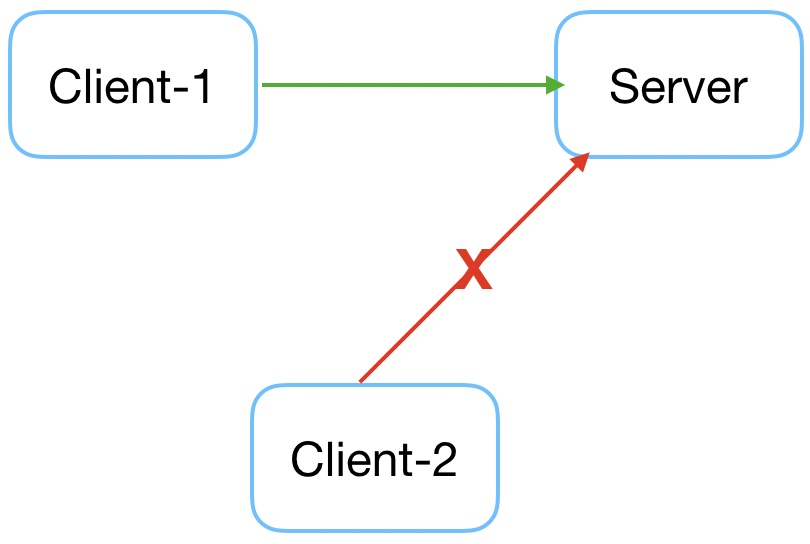
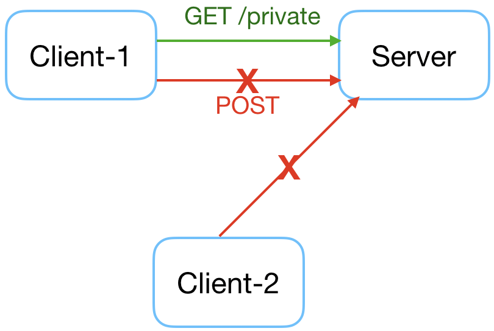
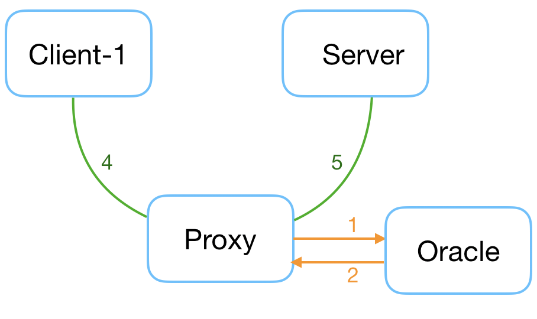

# Getting started
> - Add requirements/environment in each case (do we need all these case?)
> - Setting up the proxy in a standalone mode from source code (no control plane needed).  
> - Testbed setup, where can play with basic policies maybe ..
> - getting started example with k8s.

####  Step 1: Install requirements
##### Docker

Install and run [Docker Desktop](https://www.docker.com/products/docker-desktop). Alternatively, Docker can be installed using Self Service (Jamf).

##### Vagrant

Download and install [Vagrant](https://www.vagrantup.com/downloads.html). By default it will be installed under `/opt/vagrant`. To uninstall follow [these instructions](https://www.vagrantup.com/docs/installation/uninstallation.html).

Alternatively, you can also manage the Vagrant installation using [Homebrew](https://brew.sh).

```shell
$ brew cask install vagrant
```

##### Install the docker compose plugin
The test containers are started using docker-compose.

    $ vagrant plugin install vagrant-docker-compose

####  Step 2: Setup environment

Then navigate into `testbed/` and run `vagrant up`:

	$ cd armour/testbed
   	$ vagrant up
 
This might take couple of minutes since it needs to download all the dependencies and compile Armour master and proxy.

##### Access the VM
Once `vagrant up` command runs successfully, ssh into the vagrant VM.

	$ vagrant ssh
	
Inside the VM, run the following commands to start the containers and set the iptables rules to redirect all of the containers traffic to the armour proxy:

	$ cd /vagrant
	$ docker-compose up -d
	$ ./rules.sh

####  Step 3: Simple Test	
At this point, open two terminal windows, both ssh into the vagrant VM:

A server is already running in another container called `server`.


| Steps | Armour Proxy | Client  |
|:-------:| ------ | --------- |
|**1**| <pre>$ vagrant ssh </pre>|<pre>$ vagrant ssh </pre>|
|**2**| <pre>$ cd ~/binaries <br>$ ./armour-master <br>> launch log <br>> http start 6002</pre> ||
|**3**|  |<pre>$ docker exec -it client-1 curl http://server:80/ <br>> Access denied </pre>|
|**4**| <pre>> allow all </pre> ||
|**5**|  |<pre>$ docker exec -it client-1 curl http://server:80/ <br>> Response! </pre>|

#### Step 4: Policies Test 
We'll try to show case some of the basic policies that can be written with the Armour language.

Policies should be saved in a file (no restrictions on the extension of the file so far)
 
| Graph | Policy  |
| ------ | --------- |
| |**ID based policy** <pre>fn allow&#95;rest&#95;request(req: HttpRequest) -> bool { <br>  let c = req.connection(); <br>  let (from, to) = c.from_to(); <br>  if "server" in to.hosts() {<br>    "client-1" in from.hosts() <br>  } else {false}<br> }</pre>|
||**Method based policy**  <pre>fn allow&#95;rest&#95;request(req: HttpRequest) -> bool { <br>  let c = req.connection(); <br>  let (from, to) = c.from_to(); <br>  if "server" in to.hosts() {<br>    "client-1" in from.hosts() <br>      &#38;&#38; req.method() == "GET" <br>      &#38;&#38; req.path() == "private" <br>  } else {false}<br> }</pre>|
||**Payload based policy** <pre>fn allow&#95;server&#95;payload(payload: Payload) -> bool {<br>  payload.data().len() < 3000 <br>} </pre>|
||**Use oracles**<pre>external logger @ "log&#95;sock" { <br> fn log(&#95;) -> () <br>} <br>fn allow&#95;rest&#95;request(req: HttpRequest) -> bool {<br>  logger::log(req);<br>  true <br>}</pre> So far we have 2 oracles to use, a logger and a Docker engine query oracle|

To apply the policies while the proxy is running: 

| Steps | Armour Proxy | Client  |
|:-------:| ------ | --------- |
|**1**| <pre>> policy test1.policy</pre> |<pre>$ docker exec -it client-1 curl http://server:80/private <br>> Response! <br>$ docker exec -it client-2 curl http://server:80/private <br>> Access denied </pre>|
|**4**| <pre>> allow all </pre> |<pre>$ docker exec -it client-1 curl http://server:80/ <br>> Response! </pre>|
|**5**| <pre>> deny all </pre>|<pre>$ docker exec -it client-1 curl http://server:80/ <br>> Access denied! </pre>|
