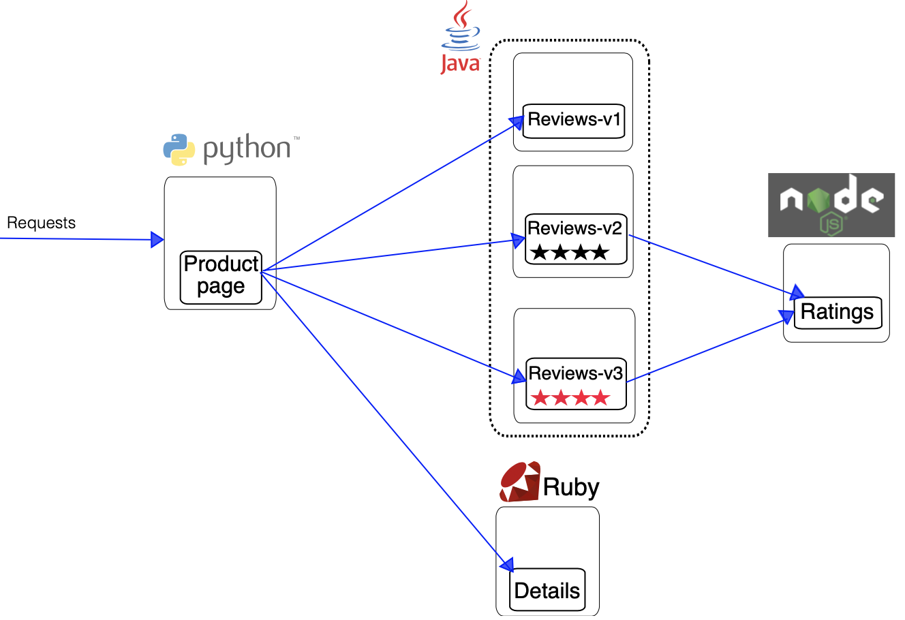
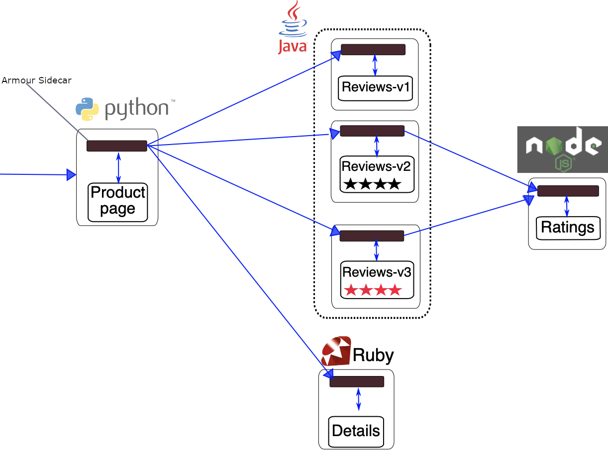

Bookinfo application demo on k3s
=========================

The following demo shows a full application, [bookinfo](https://istio.io/latest/docs/examples/bookinfo/) created by istio team, integrate with Armour running k3s.
## VM setup

For VM setup, follow instructions in the [Getting started with k3s](../k3s/README.md) guide.

## Bookinfo app

The Bookinfo application is broken into four separate microservices:

- *productpage*: The productpage microservice calls the details and reviews microservices to populate the page.
- *details*: The details microservice contains book information.
- *reviews*: The reviews microservice contains book reviews. It also calls the ratings microservice.
- *ratings*: The ratings microservice contains book ranking information that accompanies a book review.

There are 3 versions of the reviews microservice:

- Version v1 doesn’t call the ratings service.
- Version v2 calls the ratings service, and displays each rating as 1 to 5 black stars.
- Version v3 calls the ratings service, and displays each rating as 1 to 5 red stars.

The end-to-end architecture of the application is shown below.



To run the sample application with Armour requires no modifications to the application itself, only inject Armour data-planes as sidecar proxies in the yaml files.




### Run demo

Start three terminal windows and in each `ssh` into the server node VM:

```sh
host$ cd armour/examples/bookinfo
host$ vagrant ssh vm01
```

The terminals correspond with the following
	
   1. **Armour control plane**
   1. **Armour-ctl commands**
   1. **K3s demo application**


**Armour control plane [1]**

 ```sh
 vagrant@vm01:~$ cd /vagrant
 vagrant@vm01:/vagrant$ sudo systemctl start mongod
 vagrant@vm01:/vagrant$ ./armour-control
 ```
**Armour-ctl commands [2]**

 ```sh
 vagrant@vm01:~$ cd /vagrant
 vagrant@vm01:/vagrant$ ./armour-ctl update -p allow.policy -s productpage
 vagrant@vm01:/vagrant$ ./armour-ctl update -p allow.policy -s ratings
 vagrant@vm01:/vagrant$ ./armour-ctl update -p allow.policy -s details
 vagrant@vm01:/vagrant$ ./armour-ctl update -p allow.policy -s reviews1
 vagrant@vm01:/vagrant$ ./armour-ctl update -p allow.policy -s reviews2
 vagrant@vm01:/vagrant$ ./armour-ctl update -p allow.policy -s reviews3
 ```

**K3s demo application [3]**

 ```sh
 vagrant@vm01:~$ cd /vagrant
 vagrant@vm01:/vagrant$ kubectl apply -f bookinfo-armour.yaml
 ```
 At this point, on terminal **[1]** you should see the armour-hosts and proxies getting onboarded. Wait couple of seconds and Run:
 
 **K3s demo application [3]**

 ```sh
 vagrant@vm01:~$ kubectl get all -n armour
  ```
 ```sh
NAME                                  READY   STATUS      RESTARTS   AGE
pod/reviews-v2-7d79d5bd5d-9s659       2/2     Running     0          15s
pod/details-v1-558b8b4b76-h6zfn       2/2     Running     0          15s
pod/productpage-v1-6987489c74-q926h   2/2     Running     0          14s
pod/ratings-v1-7dc98c7588-jxn25       2/2     Running     0          15s
pod/reviews-v1-7f99cc4496-95kzl       2/2     Running     0          15s
pod/reviews-v3-7dbcdcbc56-zmmcl       2/2     Running     0          15s

NAME                  TYPE        CLUSTER-IP      EXTERNAL-IP     PORT(S)          AGE
service/kubernetes    ClusterIP   10.43.0.1       <none>          443/TCP          19h
service/details       ClusterIP   10.43.29.224    172.42.42.102   9080/TCP,32000/TCP                       107s
service/ratings       ClusterIP   10.43.89.238    172.42.42.102   9080/TCP,32001/TCP                       107s
service/reviews       ClusterIP   10.43.106.230   172.42.42.102   9080/TCP,32002/TCP,32003/TCP,32004/TCP   107s
service/productpage   ClusterIP   10.43.113.134   172.42.42.102   9080/TCP,32005/TCP                       107s

 ```
 Use the `Cluster-IP` to reach services
 
 ```sh
vagrant@vm01:~$ kubectl exec "$(kubectl get pod -n armour -l app=ratings -o jsonpath='{.items[0].metadata.name}')" -c ratings -n armour -- curl productpage:9080/productpage | grep -o "<title>.*</title>"
<title>Simple Bookstore App</title>
 ```
 
 **Armour-ctl commands [2]**

 ```sh
 vagrant@vm01:/vagrant$ ./armour-ctl update -p deny.policy -s ratings
 ```
 
  **K3s demo application [3]**

 ```sh
vagrant@vm01:~$ kubectl exec "$(kubectl get pod -n armour -l app=ratings -o jsonpath='{.items[0].metadata.name}')" -c ratings -n armour -- curl productpage:9080/productpage | grep -o "<title>.*</title>"
Request denied!
 ```
 
 Bring the services down:
 **K3s demo application [3]**

 ```sh
 vagrant@vm01:/vagrant$ kubectl delete -f bookinfo-armour.yaml
 ```
