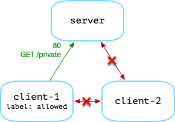
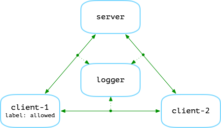

Control Plane
=============

The following demonstrates Armour running with a control plane.

---

### Policies

Three policies are used in this example. They are located in `examples/control-plane/policies/`.

#### `id.policy`

```rust
fn allow_rest_request(req: HttpRequest) -> bool {
  let (from, to) = req.from_to();
  to.server_ok() && from.has_label('allowed')
}

fn server_ok(id: ID) -> bool {
  "server" in id.hosts() &&
  if let Some(port) = id.port() {
    port == 80
  } else {
    // default is port 80
    true
  }
}
```

This will allow requests to the host `server` on port `80`, provided the source service is tagged with the label `allowed`.

<center>

</center>

> Note: only service `client-1` is tagged as `allowed` in the `armour-compose.yml` file.
> 
> Tags can also come from interacting with the `armour-control` and `armour-host` components.


#### `method.policy`

```rust
fn allow_rest_request(req: HttpRequest, payload: data) -> bool {
    let (from, to) = req.from_to();
    to.server_ok() && from.has_label('allowed') &&
    req.method() == "GET" && req.path() == "/private" && payload.len() == 0
}

fn server_ok(id: ID) -> bool {
  "server" in id.hosts() &&
  if let Some(port) = id.port() {
    port == 80
  } else {
    // default is port 80
    true
  }
}

fn allow_rest_response(res: HttpResponse) -> bool {
    res.status() == 200
}
```
This is similar to `id.policy` but it also checks the *method*, *path* and *payload* of the request, as well as the server response.

<center>

</center>

#### `log.policy`

```rust
external logger @ "log_sock" {
  fn log(_) -> ()
}

fn allow_rest_request(req: HttpRequest) -> bool {
  logger::log(req);
  true
}
```
All request are accepted. However, request details are sent to a logger service.
<center>

</center>


---

### Setup

1. Setup and start the Vagrant VM, see [README](../README.md).
1. Start four terminal windows and in each `ssh` into the vagrant VM:

   ```sh
   host$ cd armour/examples
   host$ vagrant ssh
   ```

	The terminals correspond with the following
	
   1. **Admin**
   1. **Armour control plane**
   1. **Armour data plane**
   1. **Client**


### Example

Perform the following sequence of commands:

1. Start MongoDB and generate `iptables` scripts.
	
	**Admin [1]**
	
	```sh
	vagrant$ sudo systemctl start mongod
   vagrant$ cd examples/control-plane-onboard
   vagrant$ armour-launch armour-compose.yml rules
   generated files: rules_up.sh, rules_down.sh, rules_hosts.sh
	```

1. Start the control plane

	**Control plane [2]**

	```sh
	vagrant$ cd examples
	vagrant$ RUST_MIN_STACK=8388608 armour-control
	```

1. Install `id.policy` and then query the control plane to check if it is installed.
	
	**Admin [1]**
	
	```sh
   vagrant$ armour-ctl update-global -p policies/global.policy
   vagrant$ armour-ctl update-onboarding -p policies/onboarding.policy
   vagrant$ armour-ctl query-onboarding
   vagrant$ armour-ctl query-global 
	```

1. Start the data plane

	**Data plane [3]**

	```sh
	vagrant$ cd examples
	vagrant$ ARMOUR_PASS=password armour-host
	```

1. Start the services and apply the `iptables` rules.
	
	**Admin [1]**
	
	```sh
   vagrant$ sudo ./rules_hosts.sh
   vagrant$ armour-launch armour-compose.yml up
   vagrant$ sudo ./rules_up.sh
	```

   > Note: the launch command will take some time on the first call, as docker images will be pulled.

1. Make some requests
	
	**Client [4]**
	
	```sh
   vagrant$ docker exec -ti client-1 curl http://server:80
   response!
   vagrant$ docker exec -ti client-2 curl http://server:80
   bad client request
	```

1. Change the policy to `log.policy` and start a `logger`
	
	**Admin [1]**
	
	```sh
   vagrant$ armour-ctl update -p policies/log.policy -s armour
   vagrant$ logger ../log_sock
	```

1. Make some requests
	
	**Client [4]**
	
	```sh
   vagrant$ docker exec -ti client-1 curl http://server:80
   response!
   vagrant$ docker exec -ti client-2 curl http://server:80
   response!
	```

1. Stop the `logger` and change the policy to `method.policy`
	
	**Admin [1]**
	
	```sh
   logger:> quit
   vagrant$ armour-ctl update -p policies/method.policy -s armour
	```

1. Make some requests

	**Client [4]**
	
	```sh
   vagrant$ docker exec -ti client-1 curl http://server:80
   bad client request
   vagrant$ docker exec -ti client-1 curl http://server:80/private
   private area
   vagrant$ docker exec -ti client-1 curl --request POST http://server:80/private
   bad client request
   vagrant$ docker exec -ti client-1 curl --request GET --data hello http://server:80/private
   bad client request
   vagrant$ docker exec -ti client-2 curl http://server:80/private
   bad client request
	```

1. Stop the services and remove the `iptables`rules
	
	**Admin [1]**
	
	```sh
   vagrant$ armour-launch armour-compose.yml down
   vagrant$ sudo ./rules_down.sh
	```

1. Stop the data plane

	**Data plane [3]**

	```sh
	armour-host:> quit
	```

1. Stop the control plane

	**Control plane [2]**

	```
	^C
	```