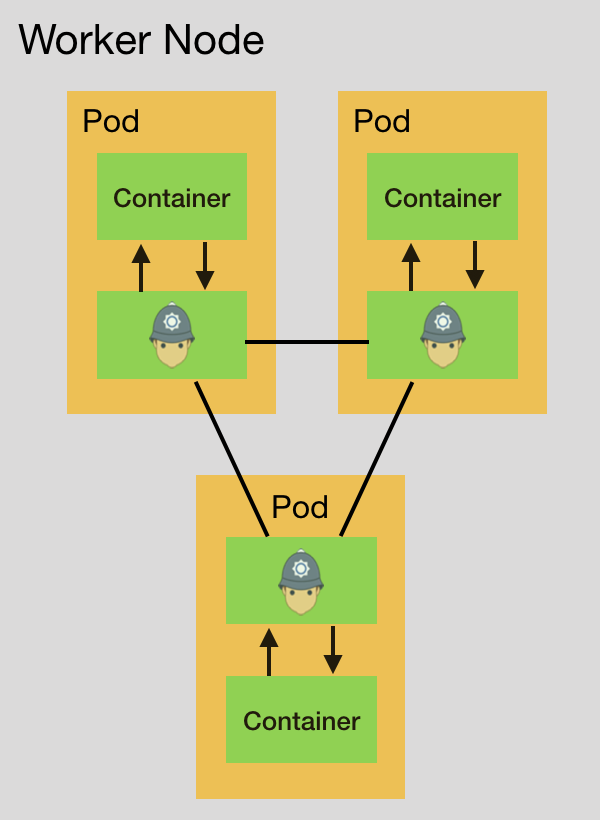

Getting Started Using K3s
=========================

The following example shows how to run Armour on [k3s](https://k3s.io), a lightweight version of kubernetes better suited for resource constraint devices, IoT devices and ARM devices. 

## VM setup

The `Vagrantfile` provided starts up 2 VMs, one can be used as a server k3s node with the IP `172.42.42.101` and the other as a worker node with the IP `172.42.42.102`.
> Pay attention to where to run each command. (host, vm01, vm02)

Run these commands to create the VMs:

 ```sh
 host$ cd armour/examples/k3s
 host$ vagrant up
 ```

### Install K3s Server Node

In this example we'll use docker as a container runtime.

 ```sh
 host$ vagrant ssh vm01
 vagrant@vm01:~$ curl -sfL https://get.k3s.io | INSTALL_K3S_EXEC="--node-ip=172.42.42.101 --flannel-iface=enp0s8 --write-kubeconfig-mode=644" sh -s - --docker
 ```
Make sure the server node is installed:

 ```sh
 vagrant@vm01:~$ kubectl get nodes
 
 NAME   STATUS   ROLES    AGE   VERSION
vm01   	Ready    master   16d   v1.18.6+k3s1
 ```
 
### Install a Worker Node

To add a worker node to the cluster, we'll need the `token`  in `/var/lib/rancher/k3s/server/token` file on the server node.

 ```sh
 vagrant@vm01:~$ cat /var/lib/rancher/k3s/server/token
 ```
Replace `{Token}` in the next command

```sh
host$ vagrant ssh vm02
vagrant@vm02:~$ curl -sfL https://get.k3s.io | INSTALL_K3S_EXEC="--node-ip=172.42.42.101 --flannel-iface=enp0s8" K3S_URL="https://172.42.42.102:6443" K3S_TOKEN="{Token}" sh -s - --docker
``` 
 
Make sure the worker node is installed and added to the cluster:

 ```sh
 vagrant@vm01:~$ kubectl get nodes
 
 NAME  	STATUS   ROLES    AGE   VERSION
vm01   	Ready    master   16d   v1.18.6+k3s1
vm02   	Ready    <none>   16d   v1.18.6+k3s1
 ```


## Adding Armour data-plane to the worker nodes

There are few design choices of how to integrate Armour's data-plane in the worker nodes, inject the data-plane as a sidecar in each pod or run the data-plane as a kubernetes daemonset. In this example, the sidecar model will be used.
> [This document](https://wecode.wepay.com/posts/scds-battle-of-containerization) explains the difference between the 2 setups and highlights the pros and cons of each.

#### Sidecar proxy



 Start three terminal windows and in each `ssh` into the server node VM:

```sh
host$ cd armour/examples/k3s
host$ vagrant ssh vm01
```

The terminals correspond with the following
	
   1. **Armour control plane**
   1. **Armour-ctl commands**
   1. **K3s demo application**


**Armour control plane [1]**

 ```sh
 vagrant@vm01:~$ cd /vagrant
 vagrant@vm01:/vagrant$ sudo systemctl start mongod
 vagrant@vm01:/vagrant$ ./armour-control
 ```
**Armour-ctl commands [2]**

 ```sh
 vagrant@vm01:~$ cd /vagrant
 vagrant@vm01:/vagrant$ ./armour-ctl update -p allow.policy -s client
 vagrant@vm01:/vagrant$ ./armour-ctl update -p allow.policy -s server
 ```

**K3s demo application [3]**

 ```sh
 vagrant@vm01:~$ cd /vagrant
 vagrant@vm01:/vagrant$ kubectl apply -f demo.yaml
 ```
 At this point, on terminal **[1]** you should see the armour-hosts and proxies getting onboarded. Wait couple of seconds and Run:
 
 **K3s demo application [3]**

 ```sh
 vagrant@vm01:~$ kubectl get all -n armour
 
NAME         READY   STATUS    RESTARTS   AGE
pod/client   2/2     Running   0          6s
pod/server   2/2     Running   0          6s

NAME                     TYPE       CLUSTER-IP     EXTERNAL-IP     PORT(S)                        AGE
service/client-service   NodePort   10.43.194.83   172.42.42.102   80:31124/TCP,32001:32001/TCP   6s
service/server-service   NodePort   10.43.69.237   172.42.42.102   80:31237/TCP,32000:32000/TCP   6s
 ```
 Use the `Cluster-IP` to reach the client and server
 
 ```sh
 vagrant@vm01:~$ kubectl exec -n armour client -c client curl 10.43.69.237
Response!
 ```
 
 **Armour-ctl commands [2]**

 ```sh
 vagrant@vm01:/vagrant$ ./armour-ctl update -p deny.policy -s client
 ```
 
  **K3s demo application [3]**

 ```sh
 vagrant@vm01:~$ kubectl exec -n armour client -c client curl 10.43.69.237
Request denied!
 ```
 
 Bring the services down:
 **K3s demo application [3]**

 ```sh
 vagrant@vm01:/vagrant$ kubectl delete -f demo.yaml
 ```