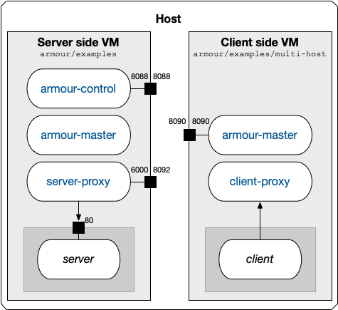

Multi-host
==========

The following demonstrates Armour running separate hosts (VMs).

---

### Policies

Two policies, located in `policies/`, will be used in this example.

#### `egress.policy`

```
fn allow_rest_request() -> bool {
  Egress::add_label('egress-ok');
  true
}

fn allow_rest_response() -> bool {
  Ingress::has_label('ingress-ok')
}
```

This will add *egress* meta-data to the request (label `egress-ok`) and check that *ingress* meta-data (label `ingress-ok`) has been added to the response.

#### `egress-private.policy`

```
fn allow_rest_request(req: HttpRequest) -> bool {
  Egress::add_label('egress-ok');
  req.path() == "/private"
}

fn allow_rest_response() -> bool {
  Ingress::has_label('ingress-ok')
}
```

This is the same as `egress.policy` but it also checks that the path of the request is `/private`.

#### `ingress.policy`

```
fn allow_rest_request() -> bool {
  Ingress::has_label('egress-ok')
}

fn allow_rest_response() -> bool {
  Egress::add_label('ingress-ok');
  true
}
```

This will check that *egress* meta-data has been added to the request (label `egress-ok`) and will add *ingress* meta-data to the response (label `ingress-ok`).

---

### Setup

The setup makes use of two VMs, which are configured as follows
<center>

</center>

This setup is initialised as follows:

1. Setup and start the first Vagrant VM, see [README](../README.md).
1. Setup and start a second Vagrant VM

	```shell
	% cd armour/examples/multi-host
	% ./setup.sh
	```

1. Start three terminal windows that `ssh` into the first Vagrant VM (server side):

   ```shell
   % cd armour/examples
   % vagrant ssh
   ```

	The terminals will correspond with the following
	
   1. **Admin**
   1. **Armour data plane**
   1. **Armour control plane**  

1. Start another three terminal windows that `ssh` into the second Vagrant VM (client side):

   ```shell
   % cd armour/examples/multi-host
   % vagrant ssh
   ```

	The terminals will correspond with the following

   1. **Admin**  
   1. **Armour data plane**  
   1. **Client**

---

### Example

Perform the following sequence of commands:

#### Server side

1. Start MongoDB and the control plane.
	
	**Admin [1.1]**
	
	```
   $ sudo systemctl start mongod
	```

1. Start the control plane

	**Control plane [1.2]**

	```
	$ armour-control
	```

1. Start the data plane

	**Data plane [1.3]**

	```
	$ ARMOUR_PASS=password armour-master
	```

1. Install `ingress.policy` and `egress.policy`, and then start the server.
	
	**Admin [1.1]**
	
	```
	$ cd examples/multi-host
	$ armour-ctl update -p policies/ingress.policy -s server
	$ armour-ctl update -p policies/egress.policy -s client
	$ armour-launch armour-ingress.yml up
	```

#### Client side

1. Generate `iptables` scripts and find out the IP of the host machine.
	
	**Admin [2.1]**
	
	```
   $ cd examples/multi-host
   $ armour-launch armour-egress.yml rules
   generated files: rules_up.sh, rules_down.sh, rules_hosts.sh
	$ netstat -rn
	```
	
	The host IP is the *gateway* IP for destination `0.0.0.0`. Below we assume the host IP is `10.0.2.2`.

1. Start the data plane using the `--label`, `-c` and `-u` flags.

	**Data plane [2.2]**

	```
	$ ARMOUR_PASS=password armour-master --label client-master \
	    -c 10.0.2.2:8088 -u 10.0.2.2:8090
	```
	
1. Start the client service and set the `iptables` rules.
	
	**Admin [2.1]**
	
	```
	$ armour-launch armour-egress.yml up
	$ sudo ./rules_up.sh
	```

1. Try to make a request from the client

	**Client [2.3]**

	```
	$ docker exec -ti client curl http://10.0.2.2:8092
	response!
	```
	
1. Try to make a request directly from the VM

	**Admin [2.1]**

	```
	$ curl http://10.0.2.2:8092
	bad client request
	```

1. Try to make a request from the host machine

	```
	% curl http://localhost:8092
	bad client request
	```

1. Change the policy to `egress-private.policy`.

	**Admin [2.1]**

	```
	$ armour-ctl -c 10.0.2.2:8088 update -p policies/egress-private.policy -s client
	```

1. Try to make requests from the client

	**Client [2.3]**

	```
	$ docker exec -ti client curl http://10.0.2.2:8092
	bad client request
	$ docker exec -ti client curl http://10.0.2.2:8092/private
	private area
	```
	
1. Bring down the client

	**Admin [2.1]**

	```
	$ armour-launch armour-egress.yml down
	$ sudo ./rules_down.sh
	```

1. Stop the data plane.

	**Data plane [2.2]**

	```
	armour-master:> quit
	```

#### Server side

1. Stop the server.
	
	**Admin [1.1]**
	
	```
   $ armour-launch armour-ingress.yml down
	```

1. Stop the data plane.

	**Data plane [1.2]**

	```
	armour-master:> quit
	```

1. Stop the control plane.

	**Control plane [1.3]**

	```
	^C
	```
