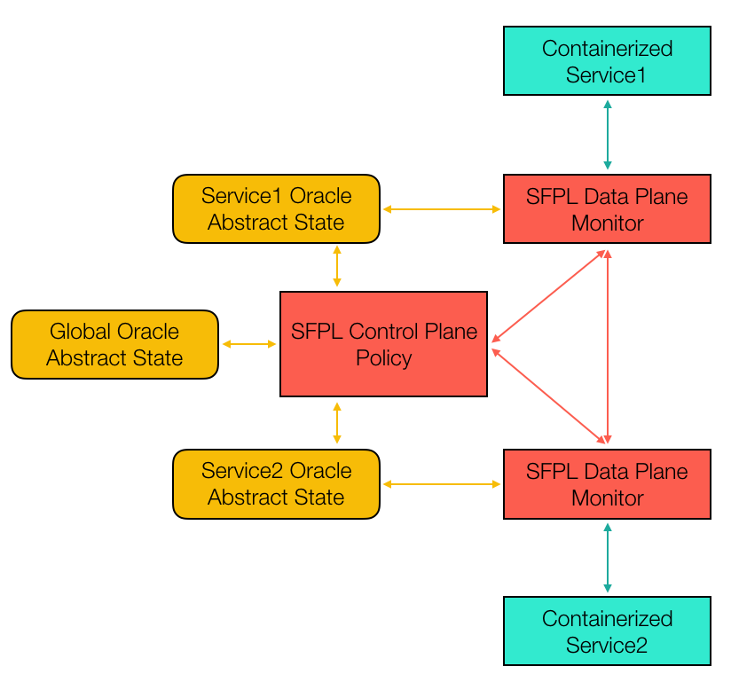

# Table of Contents

1.  [SPFL Objectives and Requirements](#orgb044a99)
    1.  [TODO](#org9e8a4f6)
2.  [SFPL Proposed Syntax](#orge45332f)
3.  [Distributed Architecture](#org0d16491)
    1.  [Architecture Overview](#org3bb50c6)
    2.  [And SFPL monitored call](#org1d8d7fa)
    3.  [Implementation aspects](#orgc767059)
        1.  [Centralized monitoring:](#orgebedc2a)
        2.  [Multi-oracle pre/post-conditions](#org9080892)
        3.  [Ingress vs. egress validation](#org60d13d8)
        4.  [Manipulation of the abstract state](#orga27ac4b)
        5.  [Implementation of the Oracles](#orgf0db774)
4.  [Publish Subscribe (PubSub) Architecture](#org264615f)
    1.  [An SFPL monitored publish](#org80515f8)
5.  [Demonstration Use-case](#org89e8311)
    1.  [Use Case Architecture](#org2faeeff)
        1.  [API](#orgc7ce623)
        2.  [Verification conditions](#org0a3e7b1)
        3.  [Notes:](#org67fb496)

# SPFL Objectives and Requirements

## TODO

# SFPL Proposed Syntax

# Distributed Architecture

## Architecture Overview

Figure [1](#orge6842cb) presents a view of the architecture
planned for SFPL running only two containerized services: Service1 and
Service2. Each of the services has a single connection to an SFPL
Monitor, which is implemented by a data-processing proxy. These
monitors enact the SFPL policy related to the service to which they
connect. In particular, SFPL policies might need to keep track of some
abstraction of the state being manipulated by the application. Typical
examples would be the tracking of sessions, the monitoring of data and
information flows, etc. 
To avoid exposing the application code to the policy, SFPL keeps an
abstract version of the state being manipulated by the application. In
particular, a good design would only keep the data strictly necessary
to implement the policies at hand.
The current implementation of SFPL would define for the public API of
each service a number of pre and post-conditions that define whether
the calls are allowed to be made, depending on the caller, the
receiver, and the current abstract state as tracked by the SFPL
monitors. Since the SFPL policies could predicate on this state, we
provide service oracles, which are query functions on the current
abstract state to validate or deny a particular call.
In the example of [1](#orge6842cb) there are only two services,
and to simplify the argument we have chosen to have an oracle for each
for them. In a nutshell, these oracles keep the SFPL-related state
that is required to validate the pre and post-conditions of the calls
made and received by each of the services.
Finally, we would have a central SFPL control plane which takes care
of the coordination and distribution of the policies to the concerned
monitors. We will leave this component rather abstract for the time
being.

## And SFPL monitored call

Figure [3](#orgee815a4) presents the call sequence of a REST
request issued from Service1 to Service2. Below is a description of
the sequence of calls:

1.  A call from Service1 to Service2 is mediated by the SFPL Monitor
    proxy (S1Monitor),
2.  The Monitor evaluates the pre-condition of the call by issuing calls
    to the Oracle maintaining the abstract state of Service1. In
    essence, this is the state that SF PL records to enforce the policy
    of Service1,
3.  Assuming that the pre-condition check succeeds, the call can proceed
    from the monitor S1Monitor to the monitor of the target of the
    call: S2Monitor,
4.  Upon receving the call, the S2Monitor might additionally perform
    some pre-condition checks related to the execution of the call from
    the stand-point of Service2. Notice that since we assume that all
    the monitors are controlled by a single controller, the checks on
    egress of S1Monitor and ingress of S2Monitor might be collapsed to
    a single check. In that case the checking monitor might need to
    access both S1Oracle, and S2Oracle. Moreover, while in the diagram
    the oracles are separated as different services, they could reside
    in a single monitor,
5.  If all checks sauced, the call is actually forwarded to Service2
    which executes it and returns the response to its SFPL monitor for
    further processing,
6.  When receiving the response, S2Monitor could chose to verify the
    post-condition of the call, again this requires consulting S2Oracle
    (under the same provisions discussed above),
7.  Similar to the steps 2 and 4 above,
8.  The S2Monitor responds to S1Monitor, which might do some more
    post-condition checks,
9.  Same as 2, 4 and 7,
10. If all checks are accepted the response is delivered to the
    client.

## Implementation aspects

Many of the components depicted in [3](#orgee815a4) can be
simplified, and/or implemented in a number of different ways, we
consider here a number of simplifying options. 

### Centralized monitoring:

In this case, there would be a single central monitor that validates
all requests. This monitor would intercept all calls made by any
service, evaluate the pre-condition, forward the call to the receiver,
intercept the answer, evaluate the post-condition and only then
forward the answer to the caller. In this scenario the oracles could
all reside with the monitor, or be implemented as a single separate
services. This option will be considered in the next section. 

### Multi-oracle pre/post-conditions

While in the example above we have chosen to connect each monitor to a
single oracle, each monitor could query more than one oracle
(including other services oracles) since they are under the control of
SFPL. A challenge for SPFL is to separate the oracles in a way that
minimizes rpc calls, and therefore latency. 

### Ingress vs. egress validation

In the call example above we have chosen to verify each pre-condition
and post-condition both at ingress and egress, requiring a total of 4
additional roun-trips to evaluate the assertions. This is not strictly
necessary: some amount of coordination between the ingress checking
and the egress checking could make it so that the pre/post-conditions
can be checked only at one site. Moreover, we could simplify SPFL to
assume that checks are performed only on ingress or egress.

### Manipulation of the abstract state

While it simplifies the description to imagine that each service has
its own abstract state, the management of the abstract state and the
decomposition into services are not necessarily related. It could be
the case that multiple oracles are implemented as a single unit. 

### Implementation of the Oracles

There are numerous implementation choices for the oracles. Here we
present a number of options. We will consider the advantages and
disadvantages of each of them in the future: 

1.  Each oracle is implemented as a standalone service/server

2.  Each oracle is implemented as a process along-side with the monitors

3.  The oracles are implemented as a shim-layer on top of existing programming languages/frameworks for distributed programming

4.  The oracles are embedded in the RPC mechanism used for the application

5.  The oracles are centralized in the controller of SFLL

6.  &#x2026;

# Publish Subscribe (PubSub) Architecture

In this case we consider a simplified view of the architecture
presented above, where we restrict the communication of the services
to utilize an SFPL-capable Publish/Subscribe like broker. We will
develop this solution as a first attempt at demonstrating the
capabilities enabled by SFPL.

Figure [22](#orgced78a2) shows a proposed architecture where the
policies of SFPL are evaluated in a centralized server in the style of
a PubSub broker. As in the previous section we only have two services
that communicate with each other through this centralized broker. 
Unlike in the section before, a typical request in this scenario does
not involve the response phase, since only publish events are
considered.
Most aspects of this architecture are self-explanatory, with perhaps
the most salient difference being that the whole abstract state is
managed/contained with the broker. This vastly simplifies the
architecture of the previous section. 

## An SFPL monitored publish

Figure [24](#orgdfc8657) replicates the steps of
[3](#orgee815a4), but we can see that there is a single point
at which the pre-condition needs to be evaluated. All the other steps
follow the description from the previous section when considering that
there is no response in this case. 

# Demonstration Use-case

We consider a simple application where a user, an analytics service
and a data base cooperate. In this case, the data-base records
information that is private to the user, and the analytics service
queries the user data from the data-base to perform some analysis on
the data. Prior to using the user data, the analytics service must
demand consent from the user. 
In the interest of simplicity we will only simulate the consent
mechanism, leaving out concerns on communication authorization, data
validation, timeouts or error cases. We will also ignore
post-conditions. We assume that consent refers only to the use or not
of the database service with a particular userID.

## Use Case Architecture

### API

-   We assume that each service is published as a topic at which it can
    receive requests
    1.  /user/requestConsent(userID)
    2.  /analytics/grantedConsent(analytics, userID)
    3.  /db/readData(userID)
    4.  /analytics/sendData(userID, data)
-   The operations are numbered as they occur in the figure above

### Verification conditions

-   Below we provide the assertions that need to be checked by the
    monitor to check the correct execution of the monitor
    1.  No pre-condition, post-condition or effect
    2.  No pre or post-condition.
        
        Effect: 
        
            consentOracle.grantConsent(analytics, userID)
    3.  Pre-condition: 
        
            consentOracle.hasConsent(analytics, userID)
        
        No effect or post-condition.
    4.  No pre or post-condition.
        
        Effect: 
        
            consentOracle.revokeConsent(analytics, userID)

### Notes:

This is a simplistic policy whose only purpose is to check that a
simple consent policy is followed. Essentially we verify that before
each query to the data base, the querying service has been provided
consent by the user service on the userID that is being requested.
A lot of other concerns are left aside in the interest of simplicity.

